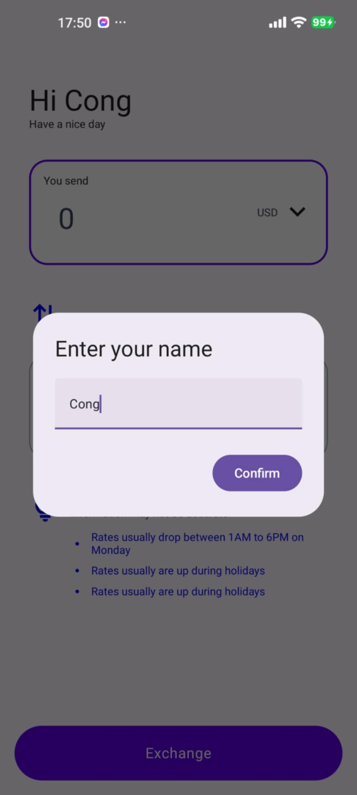
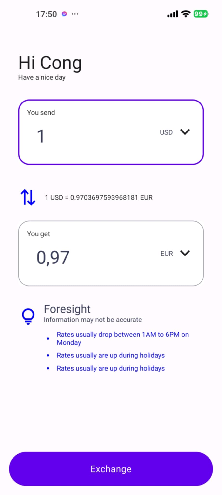

# Currency Converter

## Purpose of the App

The Currency Converter app is designed to provide users with a seamless and efficient way to convert currencies. It fetches real-time exchange rates from a reliable API and allows users to convert between different currencies with ease. The app is user-friendly and provides additional features such as historical data and foresight information to help users make informed decisions.

## Technologies Used

- **Kotlin**: For developing the Android application.
- **Jetpack Compose**: For building the UI components.
- **Retrofit**: For making network requests to fetch currency exchange rates.
- **Coroutines**: For handling asynchronous operations.
- **Material Design 3**: For a modern and intuitive user interface.
- **Gradle**: For project build and dependency management.

## App Structure

The project structure in Android Studio is organized as follows:

- **currencyconverter**
    - **data**
        - **api**
            - `CurrencyApi.kt`: Defines the API endpoints for fetching currency data.
            - `RetrofitInstance.kt`: Provides the Retrofit instance for network requests.
        - **model**
            - `CurrencyViewModel.kt`: Manages the UI-related data and business logic.
    - **ui**
        - **components**
            - `CurrencyConverterRow.kt`: UI component for displaying a row in the currency converter.
            - `Foresight.kt`: UI component for displaying foresight information.
        - **screen**
            - `HomeScreen.kt`: The main screen of the app where currency conversion takes place.
    - **theme**: Contains theme-related files for styling the app.
    - `MainActivity.kt`: The entry point of the app.

## How to Start

1. **Clone the Repository**:
    ```sh
    git clone <repository-url>
    cd CurrencyConverter
    ```

2. **Open the Project**:
    - Open the project in Android Studio.

3. **Build the Project**:
    - Ensure you have the latest version of Android Studio and the required SDKs installed.
    - Sync the project with Gradle files.

4. **Run the App**:
    - Connect an Android device or start an emulator.
    - Click on the "Run" button in Android Studio.


## Features

- Real-time currency conversion.
- Historical exchange rate data.
- User-friendly interface with Material Design 3.
- Foresight information to help users make informed decisions.

## Screenshots




## Video Demo

Watch the video demo of the Currency Converter app [here](#).

## License

This project is licensed under the MIT License - see the [LICENSE](LICENSE) file for details.

## Contact

For any inquiries or feedback, please contact [chicong442004@gmail.com](mailto:chicong442004@gmail.com).

# CodingSkills

## Requirements

- Basic understanding of Kotlin and Android development.
- Familiarity with Jetpack Compose and Material Design principles.
- Experience with Retrofit and Coroutines for network operations.
